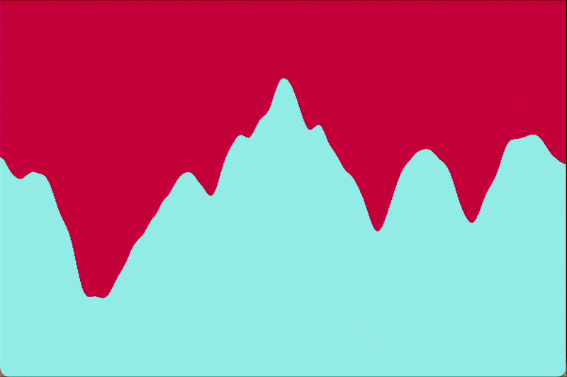
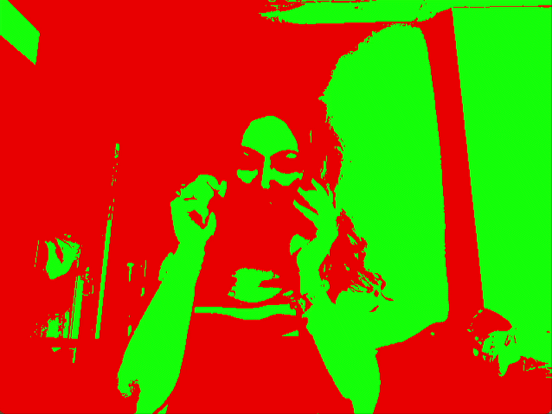
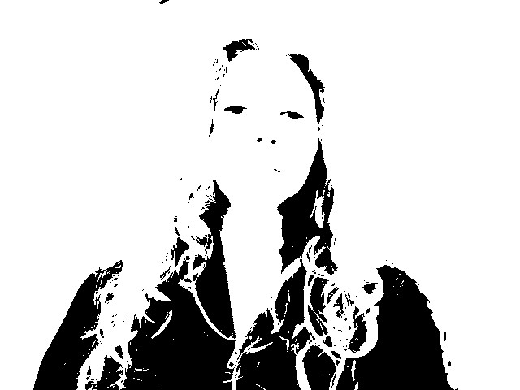
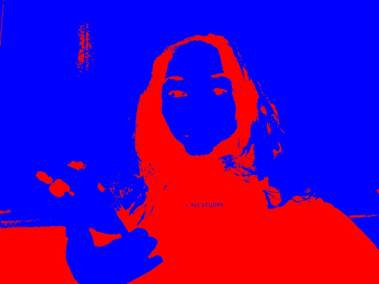
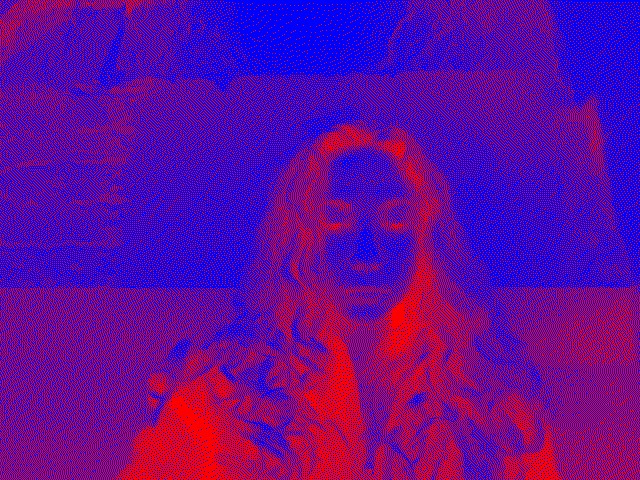
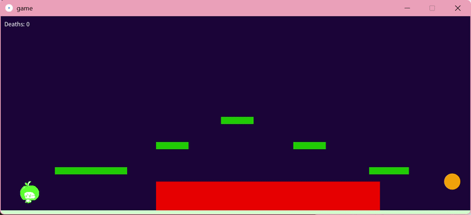
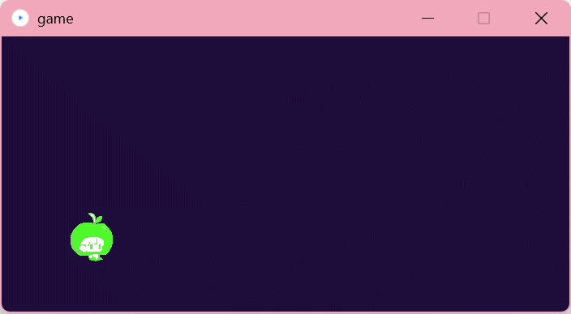
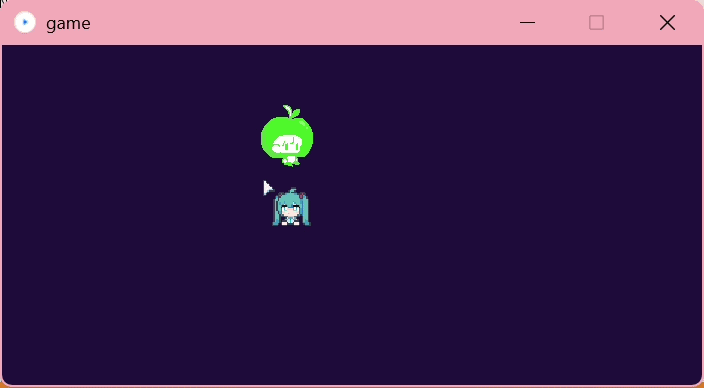
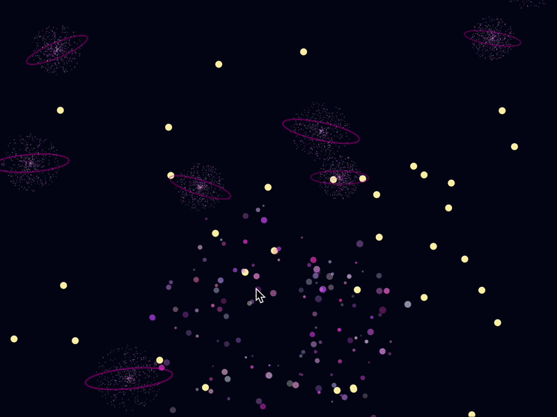
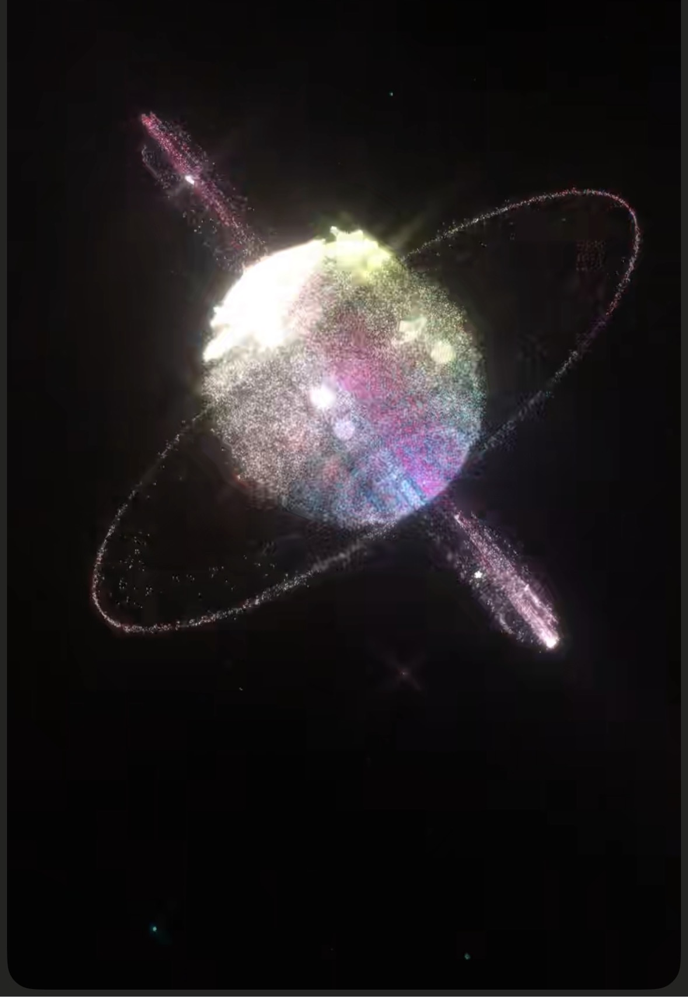

# Week 1

## Project Overview

In this project I explored different gradient techniques in Processing using the `examples/gradient` code as a starting point.

The goal was to design experimental background visuals for a fictional computational art gallery. These gradients could potentially be used for:

* Poster backgrounds
* Website animations
* Exhibition screens
* Digital branding assets

I experimented with:

* Colour palette selection
* Gradient direction
* Circular/radial gradients
* Multi-stage colour blending
* Small colour adjustments to create different moods

The palette inspiration:


The palette mainly uses:

* Deep navy blue
* Cyan / turquoise
* Purple / magenta
* Neon green accents
* Soft pink tones


---

# Gradient Variations

---

## Variation 1 — Horizontal Gradient

### Idea

This version creates a smooth horizontal transition from dark navy blue to bright cyan.

### Code Features

* Uses `map(x, 0, width - 1, 0, 1)`
* Interpolates colours with `lerpColor()`
* Gradient direction depends on the x-axis

### Colours

* `(11, 19, 43)` → dark navy
* `(57, 229, 255)` → bright cyan


---

## Variation 2 — Vertical Gradient

### Idea

This version changes the gradient direction vertically.

### Code Features

* Uses `map(y, 0, height - 1, 0, 1)`
* Gradient depends on the y-axis

### Colours

* `(11, 19, 43)` → dark navy
* `(208,119,195)` → soft pink-purple

---

## Variation 3 — Circular/Radial Gradient

### Idea

This version has a circular gradient centred in the middle of the screen.

### Code Features

* Uses `dist()` to measure distance from the centre
* Gradient radiates outward
* Introduces radial interpolation

### Colours

* `(57, 229, 123)` → neon green
* `(208,119,195)` → purple

---

## Variation 4 — Diagonal Gradient

### Idea

This version combines the x and y positions to create a diagonal transition.

### Code Features

* Uses `map(x + y, 0, height + width, 0, 1)`
* Combines horizontal and vertical movement

### Colours

* `(20, 109, 103)` → teal
* `(208,119,195)` → purple

---

## Variation 5 — Multi-Stage Radial Gradient

### Idea

This version combines two separate colour transitions inside one radial gradient.

### Code Features

* Uses conditional statements (`if`)
* Splits the gradient into two blending zones
* Combines multiple `lerpColor()` transitions

### Colours

Inner blend:

* `(107, 29, 123)` → dark purple
* `(208,107,255)` → neon purple

Outer blend:

* `(11, 229, 223)` → cyan
* `(255,19,195)` → hot pink

---

# Techniques Used

* `loadPixels()`
* `updatePixels()`
* `lerpColor()`
* `map()`
* `dist()`
* Nested loops
* Conditional colour interpolation

---
\* no AI used

# Week 3


## Overview

The sketch generates an abstract artwork by repeatedly drawing shapes across the canvas. The artwork uses loops, colour variation, and the modulo (%) operator to alternate between different shapes.

## Features

* Uses multiple **Processing primitives**:

  * `ellipse()`
  * `rect()`
  * `triangle()`
  * `line()`
* Uses the **modulo (`%`) operator** to create repeating patterns.
* Uses **nested loops** to fill the entire canvas with shapes.
* Creates a geometric abstract composition with alternating colours and forms.

## How It Works

The program divides the canvas into a grid using nested `for` loops. For each grid position, the code calculates a value using the modulo operator:

`pattern = (x + y) % 180`

This value is then used to determine which shape should be drawn. The code uses another modulo operation (`pattern % 3`) to switch between shapes:

* `0` → Draw an **ellipse**
* `1` → Draw a **rectangle**
* `2` → Draw a **triangle**

A diagonal **line** is also drawn inside each grid cell to add additional visual structure and texture to the composition.

---
\* no AI used

# Week 4


## Overview
This sketch using Perlin noise and primitive shapes in Processing. The animation produces flowing vertical lines that move smoothly creating a visual effect similar to waves or a digital landscape. 

## Key concept
Primitive Shapes: 
line() – to draw vertical lines across the canvas.

The noise() function is used to generate smooth values between 0 and 1. These values control the vertical position of the lines, producing a flowing pattern rather than random jumps.

Animation is achieved by increasing the variable t every frame:
t += 0.01;

## How It Works
The sketch uses draw() function to continuously render frames, creating animation.
A for loop iterates across the width of the canvas and draws vertical lines. The height of each line is determined using the noise() function. The variable t is gradually increased every frame. This value is used as a second parameter in the noise() function, to make the pattern slowly change and create the animated effect.

## Class work
 

\* no AI used
# Week 6

## Overview
A live camera feed processed in real time using Floyd-Steinberg dithering, thresholding, and a duotone colour effect. Press **S** to capture and save comic book panels as numbered image files.


## What I Built

### Processing (the camera app)

**Camera capture**
- Uses the `processing.video` library to access the first available webcam
- Reads a new frame every iteration of `draw()` at 30fps into a `Capture` object called `cam`


 **Greyscale** — readschannel from `cam.pixels[i]` as a proxy for brightness (works because the image is black and white after dithering)
**Threshold** — snaps each pixel to either pure black (0) or pure white (255) at a midpoint of 127


 **Duotone** — maps the black/white pixel to a colour by lerping between `colorA` (red `221,60,90`) and `colorB` (blue `6,67,169`) based on brightness using `lerpColor()`
 **Contrast boost** — applies a standard contrast formula with a high value of 222 to make the duotone pop


**Floyd-Steinberg dithering** — the difference between the original grey value and the snapped value (the *error*) is distributed to neighbouring pixels using these ratios:
   ```
   .  x  7
   3  5  1
   (all divided by 16)
   ```
   This preserves the illusion of smooth gradients even though only two values exist
  **Threshold again** — a second hard threshold at 100 applied in the second loop to sharpen the result further
 

**Saving frames**
- A boolean flag `takePicture` is set to `true` when **S** is pressed
- After `updatePixels()` completes, if the flag is set, `saveFrame("frame-####.jpg")` saves a sequentially numbered file to the sketch folder
- Using a flag rather than calling `saveFrame()` directly in `keyPressed()` ensures the pixel buffer is fully rendered before saving
---
\* AI used for Readme discription

# Week 7
## Digital Sound and Oscillation
### Sci-fi planetary landing sound using three oscillators and a low-pass filter

## Sound
https://drive.google.com/file/d/1HpXd1-TClL_pvhJgoRD7vabfztwX9dZi/view?usp=share_link
<video controls src="IMG_3243.mov" title="Title"></video> 
## Features

* Sine oscillator at 440 Hz as the main tone
* Sawtooth oscillator at 100 Hz to add a rough rumble in the end
* Triangle oscillator at 800 Hz to add a bright, eerie shimmer on top

* For frequency modulation, I used `sin(float(frameCount) / 130.)` to create a slow, continuous wobble that automatically shifts all three oscillator frequencies over time 

* Low-pass filter connected to the sine oscillator, with the cutoff frequency mapped to the mouse X position

\* AI used to add this line: `filter.process(sine1);` because I couldn't make make filter connect to the oscillator all other code was based on examples from class

# Week 8
https://drive.google.com/file/d/1r5p92iIbfMktiSwuqtEifLRLL8Qcg788/view?usp=share_link
### Algorithmic music and sampling
Four audio samples are layered into a sound pattern that evolves over time through alternating patterns and randomness.

## Samples Used
https://drive.google.com/drive/folders/1HvrZ0_9ES7kmWxoQyenc8TAvTtH_lbaB?usp=share_link

* Freesound-4.wav 
<audio controls src="week8/data/Freesound-4.wav" title="Title"></audio>
*	Freesound - Search-2.wav 
<audio controls src="week8/data/Freesound - Search-2.wav" title="Title"></audio>
*	Freesound - Search-3.wav 
<audio controls src="week8/data/Freesound - Search-3.wav" title="Title"></audio>
*	Freesound-3.wav
<audio controls src="week8/data/Freesound-3.wav" title="Title"></audio>
* Freesound - Search-1 
<audio controls src="week8/data/Freesound - Search-1.wav" title="Title"></audio>

## Sound change 

Alternating patterns: every 4 seconds `(240 frames at 60fps)`, the kick drum switches between two different step sequences using `frameCount / 240 % 2`. 

Randomness: "Freesound - Search-1"  is wrappedd in a `(random(1) > 0.5)` condition. This introduces an unpredictable pattern

## Sequencer Structure
The beat is built around a 16-step sequencer running at 60fps. Each step lasts 15 frames, giving a tempo of 120 BPM. Sounds are triggered when `frameCount % 15 == 0`, and the current step is calculated as:
`int step = (frameCount / 15) % 16;`

## Visualisation 

### \* Warning: contains flashing images
An audio-reactive visual element is created using a randomly changing background colour on every beat:
`background(random(255), random(255), random(255));`
The screen flashes a new random colour each time a beat step fires, creating a simple but effective visual rhythm that mirrors the audio

\* no AI used 

# Week 9 
## Branchless

### Collaborative work with Anika

</p>In this game, you will be a little apple who has dropped underground, instead of getting rotted, you decided to escape and go see the world. Its a simple platform game, using keyboard to interact, the goal is to explore the map and find the way to go upper ground.</p>

The visual design of this project was inspired by a game previously designed by Anika
https://www.instagram.com/reel/DTdySOEjkhh/?utm_source=ig_web_copy_link&igsh=MzRlODBiNWFlZA== 

All the physics part was done by me and the visual part by Anika. 

### Apple Class

* Designed and implemented the `Apple` class, encapsulating all player state (position, velocity, flags) and behaviour in one object

#### Force 1 — Gravity

* Implemented a frame-rate independent gravity system using `vy += GRAVITY * dt`
* Gravity constant `(1500 px/s²)` tuned to feel responsive at the game's screen scale

#### Force 2 — Friction (opposing force)

* Applied exponential velocity decay using `vx *= pow(0.75, dt * 60)` each frame
* Creates natural deceleration when no key is held — apple glides to a stop rather than cutting off instantly

\* AI help was used to add this force

#### Jump Impulse

* Implemented a one-shot jump using an instant upward velocity kick `(vy = -560)`
* Gravity then decelerates the apple naturally, producing a realistic arc
* Extended to support double-jump by tracking `jumpsUsed` and resetting on landing

#### Collision Detection & Resolution

* Implemented AABB (Axis-Aligned Bounding Box) tile collision
* X and Y axes resolved separately to prevent corner-sticking
* Collision interface abstracted into `solidAt(px, py)` — a stub my teammate fills in with their tile map, keeping our code independent


#### Keyboard Input

* Mapped both arrow keys and WASD for accessibility
* Used `keyPressed` / `keyReleased` to set boolean flags — ensures smooth movement and correct stop-on-release behaviour

# Development task 
## Week 10 
### Galaxy

### Stars 

I started by placing stars across the sky using an ArrayList to store lots of them at once. I used `ArrayList<PVector> stars = new ArrayList<PVector>();` to create the list, then filled it with random positions using:
`for (int i = 0; i < 60; i++) {
    stars.add(new PVector(random(width), random(height)));
}`
This gave me stars located randomly across the canvas

  \* AI help was turning a star into a proper class and connecting it to the main file


  Before
  


After 


\* AI help to fix that all the stars were appearing in the corner due to a wrong edge-wrapping condition
Before 

After 

 To add a randomised force that affects the whole system I added a `wind` PVector. The method `applyForce()` adds the wind into `acc`, which then updates `vel`, which updates `loc`, so every frame each star gets a tiny push in the wind direction. Every 240 frames the wind randomly changes direction
### Planets
To add the Planet class I used the Star class as a starting point — I copied the same structure `(loc, vel, acc)` and adapted the `draw()` method to give planets a completely different look, inspired by this image: 
for this I changed `void draw()`from this  to this 
I also added a ring to each planet using `pushMatrix()` and `popMatrix()` to tilt a flat ellipse at a random angle around the planet centre.
### Explosions 
To make planets explode on mouse click I created a new class called `ExpParticle`. I reused some parts like `acc`, `vel`, `loc`from the Star and Planet classes
 Each particle is spawned at the planet's position with a random outward angle and speed, and has a life value that counts down from 255 to 0, fading the particle out over time. When `isDead()` returns true the particle is removed from the `ArrayList`. I used `mousePressed()` to detect clicks on planets and trigger the explosion. 
 A lot of this code was built based on code from examples from clas 
 